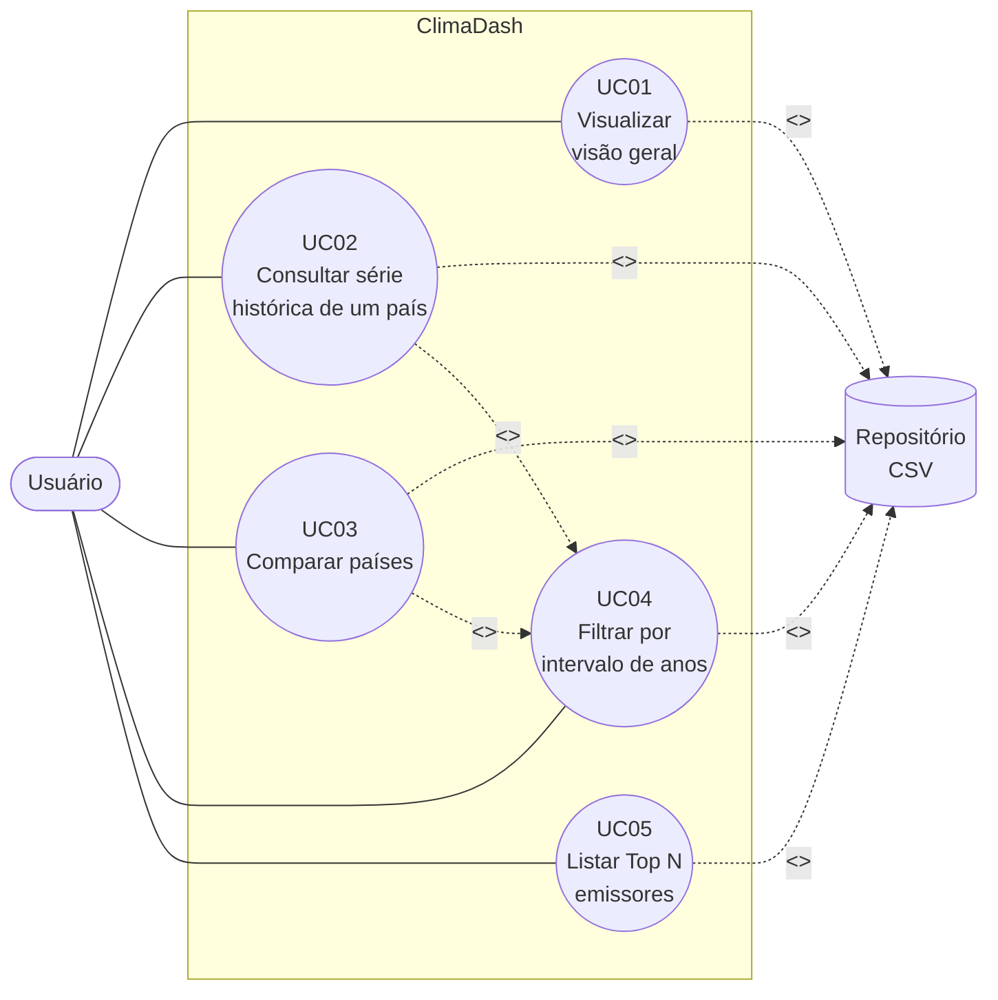

# TP1 — Casos de Uso

## Ator

- **Usuário** (visitante anônimo do dashboard — estudante, jornalista, educador, cidadão interessado).

Por se tratar de uma aplicação somente-leitura, sem autenticação, há um único ator humano. O **Repositório de Dados (CSV)** é um ator secundário (sistema), consultado pelo backend.

## Diagrama de Casos de Uso

> O diagrama é renderizado automaticamente pelo GitHub a partir do bloco Mermaid acima.

## Descrição dos Casos de Uso

### UC01 — Visualizar visão geral

- **Ator principal:** Usuário
- **Pré-condições:** O servidor está em execução; o dataset foi carregado.
- **Fluxo principal:**
  1. O usuário acessa <http://localhost:8080>.
  2. O frontend solicita `/api/summary`.
  3. O backend agrega emissões globais e média de renováveis para o último ano disponível.
  4. O frontend renderiza os cartões e os gráficos iniciais.
- **Fluxo alternativo (A1 — sem dados):** Se o dataset estiver vazio, o frontend exibe a mensagem "Sem dados disponíveis".
- **Pós-condições:** Painel renderizado.

### UC02 — Consultar série histórica de um país

- **Ator principal:** Usuário
- **Pré-condições:** UC01 executado.
- **Fluxo principal:**
  1. O usuário seleciona um país na lista.
  2. O frontend solicita `/api/countries/{country}`.
  3. O backend retorna a série histórica do país.
  4. O frontend atualiza o gráfico de evolução temporal.
- **Fluxo alternativo (A1 — país inexistente):** O backend retorna 404 e o frontend exibe "País não encontrado".

### UC03 — Comparar países

- **Ator principal:** Usuário
- **Pré-condições:** UC01 executado.
- **Fluxo principal:**
  1. O usuário marca até 5 países na seção de comparação.
  2. O frontend solicita `/api/emissions?countries=a,b,c`.
  3. O backend retorna as séries dos países solicitados.
  4. O frontend renderiza múltiplas séries no mesmo gráfico.
- **Fluxo alternativo (A1 — mais de 5):** O frontend impede a marcação adicional e exibe aviso.

### UC04 — Filtrar por intervalo de anos

- **Ator principal:** Usuário
- **Pré-condições:** UC01 executado.
- **Fluxo principal:**
  1. O usuário define ano inicial e ano final via controles.
  2. O frontend reemite a consulta corrente acrescentando `from=YYYY&to=YYYY`.
  3. O backend filtra as séries pelo intervalo.
  4. Os gráficos são atualizados.
- **Fluxo alternativo (A1 — intervalo inválido):** Se `from > to`, o frontend reverte para o último intervalo válido.

### UC05 — Listar Top N emissores

- **Ator principal:** Usuário
- **Pré-condições:** UC01 executado.
- **Fluxo principal:**
  1. O usuário define o valor de N (ex.: 5, 10).
  2. O frontend solicita `/api/top?n=N`.
  3. O backend ordena os países pelas emissões totais do último ano disponível e retorna os N primeiros.
  4. O frontend renderiza um gráfico de barras.
- **Fluxo alternativo (A1 — N inválido):** O backend assume `N=5` como padrão se o parâmetro for ausente ou inválido.
