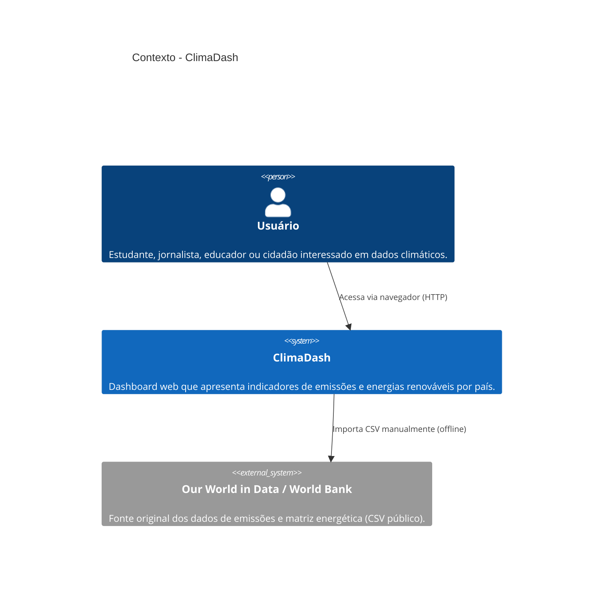
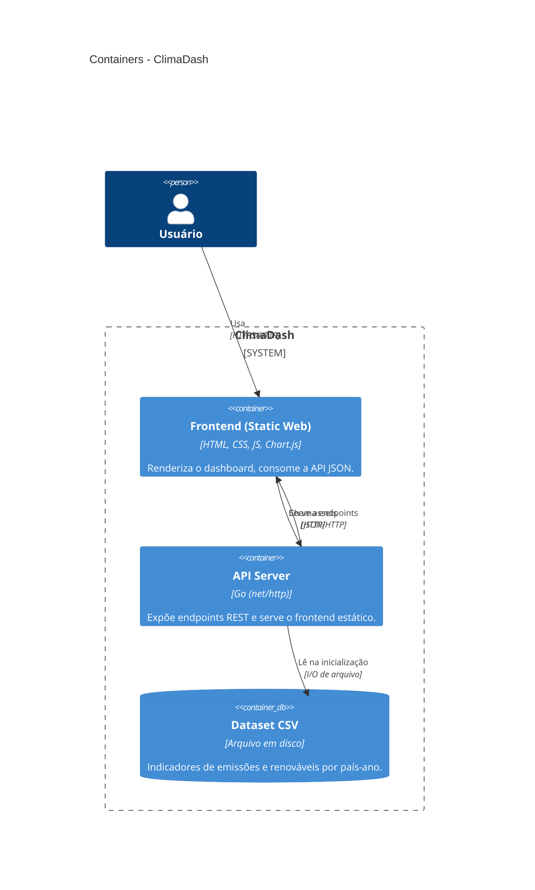
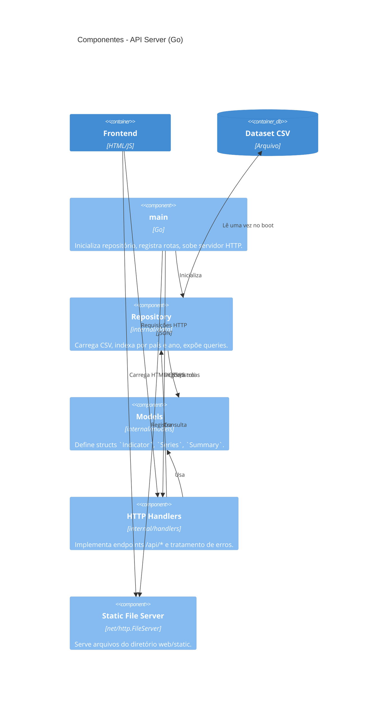

# TP2 — Projeto de Software (Arquitetura via C4 Model)

Este documento descreve a arquitetura do **ClimaDash** seguindo o **C4 Model** (Simon Brown), apresentando os níveis de Contexto, Container e Componentes. Todos os diagramas são especificados em Mermaid e renderizam automaticamente no GitHub.

## 1. Escolhas de Tecnologia

| Camada                | Tecnologia                              | Justificativa                                                                                                              |
|-----------------------|-----------------------------------------|----------------------------------------------------------------------------------------------------------------------------|
| Linguagem (backend)   | **Go 1.22**                             | Requisito do trabalho. Binário único, baixa pegada de memória, biblioteca padrão completa para HTTP + CSV + JSON.          |
| Framework HTTP        | **`net/http` (stdlib)**                 | Não há necessidade de roteamento sofisticado nem middleware. Reduz dependências e simplifica avaliação.                    |
| Persistência          | **Arquivo CSV em disco**                | O dataset é pequeno (~centenas de linhas) e essencialmente read-only. Banco relacional seria sobre-engenharia para o escopo. |
| Frontend (estrutura)  | **HTML5 + CSS3 + JS vanilla**           | Mantém o projeto leve e elimina toolchain (npm/webpack). Servido como estático pelo backend Go.                            |
| Frontend (gráficos)   | **Chart.js (via CDN)**                  | Biblioteca consolidada de gráficos canvas. Reduz complexidade de implementação.                                            |
| Formato da API        | **JSON sobre HTTP**                     | Padrão para SPAs e dashboards web; nativamente suportado por `encoding/json`.                                              |
| Build / Empacotamento | **`go build`**                          | Sem dependências externas. Resulta em um binário portátil.                                                                 |

### O que foi deliberadamente evitado

- **Banco de dados (Postgres/SQLite).** O dataset é estático; adicionaria operações de schema/migração sem benefício real.
- **Frameworks SPA (React/Vue).** A interface é pequena; um SPA introduziria pipeline de build incompatível com o foco em simplicidade.
- **Dependências externas Go.** Tudo é resolvido pela stdlib, mantendo `go.mod` enxuto.

## 2. Visão arquitetural

A aplicação adota uma arquitetura **monolítica em camadas**, com separação clara entre apresentação (frontend estático), aplicação (handlers HTTP) e dados (repositório CSV). O modelo é adequado a uma aplicação pequena, sem requisitos de escala horizontal.

### 2.1 C4 — Nível 1: Contexto



O ClimaDash não consulta a fonte externa em tempo de execução. O CSV é versionado no repositório (snapshot). Atualizações são feitas substituindo o arquivo.

### 2.2 C4 — Nível 2: Containers



### 2.3 C4 — Nível 3: Componentes (API Server)



## 3. Endpoints da API

| Método | Caminho                       | Descrição                                                            |
|--------|-------------------------------|----------------------------------------------------------------------|
| GET    | `/api/health`                 | Healthcheck simples; retorna `{"status":"ok"}`.                      |
| GET    | `/api/countries`              | Lista todos os países disponíveis.                                   |
| GET    | `/api/countries/{country}`    | Série histórica de um país específico.                               |
| GET    | `/api/years`                  | Lista os anos disponíveis no dataset.                                |
| GET    | `/api/summary`                | Visão geral: emissão global e renovável média no último ano.         |
| GET    | `/api/emissions?countries=a,b&from=Y&to=Y` | Séries de múltiplos países, com filtro opcional de anos. |
| GET    | `/api/top?n=N`                | Top N emissores no último ano disponível.                            |

Todas as respostas são `application/json; charset=utf-8`. Erros usam o padrão `{ "error": "..." }` com status HTTP apropriado (400, 404, 500).

## 4. Estrutura de pastas

```
.
├── cmd/server/main.go             # bootstrap (registra rotas, sobe HTTP)
├── internal/
│   ├── data/repository.go         # repositório CSV + queries em memória
│   ├── handlers/handlers.go       # handlers HTTP da API
│   └── models/models.go           # structs de domínio
├── web/static/                    # frontend estático
│   ├── index.html
│   ├── style.css
│   └── app.js
├── data/emissions.csv             # dataset
├── docs/                          # documentação dos TPs
├── go.mod
└── README.md
```

## 5. Justificativa do modelo escolhido

A combinação **monolito em camadas + dataset estático + frontend estático** foi escolhida por refletir, com exatidão, o tamanho real do problema:

- O escopo é informacional, não transacional — não há estado mutável compartilhado.
- O volume de dados é pequeno e cabe em memória, dispensando banco de dados.
- A separação `cmd / internal / web` segue o layout idiomático de projetos Go, facilitando manutenção e avaliação.
- A arquitetura permite, no futuro, evoluir para microsserviços (ex.: separar ingestão de dados de consulta), trocar o CSV por um banco, ou substituir o frontend, sem refatorar tudo — porque as responsabilidades já estão isoladas em pacotes/containers distintos.

Em síntese, a arquitetura prioriza **simplicidade defensável**: nada além do necessário para resolver o problema, mas com fronteiras claras para evolução.
